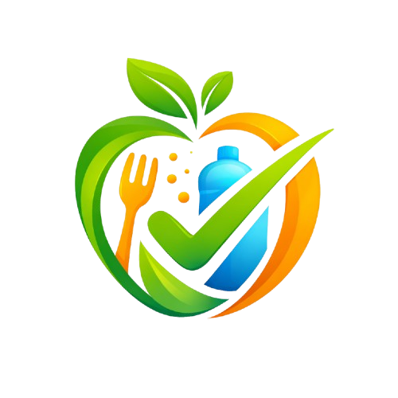
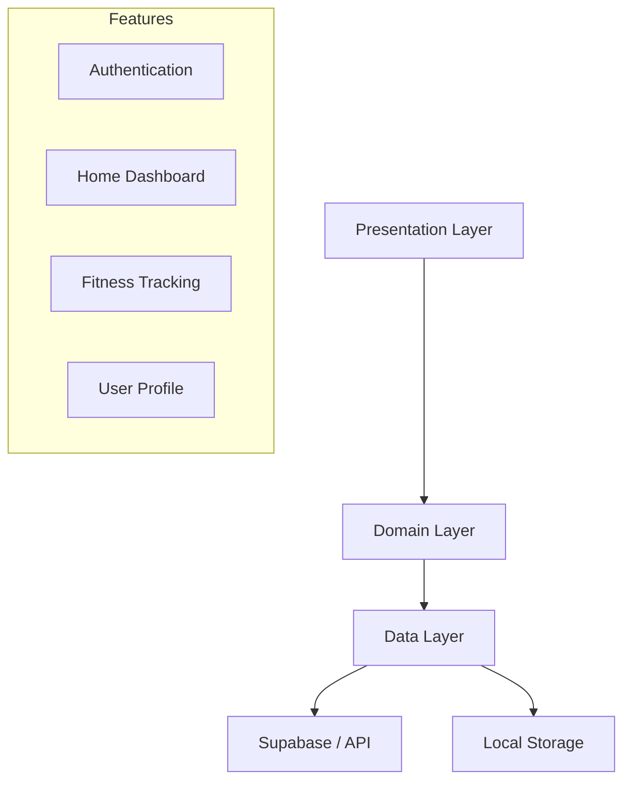

# 🧬 Fitness Geni

<div align="center">
  
</div>

<div align="center">
  
  
  
  
  
  
  
</div>

<div align="center">
  <h3>An intelligent, AI-powered personal fitness companion built with Flutter</h3>
  <p>Track nutrition, workouts, and health metrics with a premium, intelligent experience powered by Google Gemini AI and Supabase.</p>
</div>

---

## 📋 Table of Contents

- [Features](#-features)
- [Tech Stack](#-tech-stack)
- [Architecture](#-architecture)
- [Screenshots](#-screenshots)
- [Getting Started](#-getting-started)
- [Project Structure](#-project-structure)
- [AI Integration](#-ai-integration)
- [Contributing](#-contributing)
- [License](#-license)

## ✨ Features

### 🎯 Core Features
- **AI-Powered Insights**: Leveraging **Google Gemini** to provide intelligent health tips and customized recommendations.
- **Smart Nutrition Tracking**: visually track your daily meals—Breakfast, Lunch, and Dinner—with ease.
- **Health Connect Integration**: Automatically syncs steps, calories burned, and distance from **Apple Health** and **Health Connect**.
- **Visual Analytics**: Interactive graphs and charts to visualize your progress over time.
- **Goal Setting**: Set and track daily nutrition and fitness goals.

### 🔧 Technical Features
- **State Management**: Robust state management using **Riverpod** for predictable data flow.
- **Secure Authentication**: Seamless login and signup powered by **Supabase Auth**.
- **Offline Support**: Local caching strategies ensure data availability (using Shared Preferences/Secure Storage).
- **Responsive UI**: A stunning, dark-themed interface with glassmorphism and **Lottie** animations.

## 🛠️ Tech Stack

| Category | Technology |
|----------|------------|
| **Frontend** | Flutter 3.10+ (Dart) |
| **State Management** | Flutter Riverpod |
| **Backend** | Supabase (PostgreSQL, Auth, Edge Functions) |
| **AI Integration** | Google Generative AI (Gemini) |
| **Routing** | GoRouter |
| **Local Storage** | Shared Preferences, Flutter Secure Storage |
| **Charts** | FL Chart |
| **Animations** | Lottie |
| **Health Data** | Health, Permission Handler |

## 🏗️ Architecture

This application follows a **Feature-First Clean Architecture** to ensure scalability and maintainability:

```
lib/
├── core/                 # Core functionality (Constants, Theme, Utils)
├── features/             # Feature-based modules
│   ├── auth/             # Authentication (Login, Signup)
│   ├── home/             # Home Dashboard & Widgets
│   ├── fit/              # Fitness Tracking logic
│   ├── onboarding/       # User Onboarding flow
│   ├── profile/          # User Profile management
│   └── splash/           # App Splash Screen
├── shared/               # Shared widgets and logic
└── main.dart             # Application Entry Point
```

### 🔄 Data Flow



## 📱 Screenshots

<table>
  <tr>
    <td align="center">
      
      <br/>
      <sub><b>Splash Screen</b></sub>
    </td>
    <td align="center">
      
      <br/>
      <sub><b>Sign In</b></sub>
    </td>
    <td align="center">
      
      <br/>
      <sub><b>Sign up</b></sub>
    </td>
    <td align="center">
      
      <br/>
      <sub><b>Enter your weight</b></sub>
    </td>
  </tr>
  <tr>
    <td align="center">
      
      <br/>
      <sub><b>Enter height</b></sub>
    </td>
    <td align="center">
      
      <br/>
      <sub><b>Age</b></sub>
    </td>
    <td align="center">
      
      <br/>
      <sub><b>Enter diet type</b></sub>
    </td>
    <td align="center">
      
      <br/>
      <sub><b>Set your goals</b></sub>
    </td>
  </tr>
  <tr>
    <td align="center">
      
      <br/>
      <sub><b>Generate new meals</b></sub>
    </td>
    <td align="center">
      
      <br/>
      <sub><b>Add your ingridents</b></sub>
    </td>
    <td align="center">
      
      <br/>
      <sub><b>Let Ai decide</b></sub>
    </td>
     <td align="center">
      
      <br/>
      <sub><b>Wait while meals generated</b></sub>
    </td>
  </tr>
  <tr>
    <td align="center">
      
      <br/>
      <sub><b>Preview meals</b></sub>
    </td>
    <td align="center">
      
      <br/>
      <sub><b>Meals details</b></sub>
    </td>
    <td align="center">
      
      <br/>
      <sub><b>Home screen with daily track</b></sub>
    </td>
    <td align="center">
      
      <br/>
      <sub><b>Track daily progress</b></sub>
    </td>
  </tr>
  <tr>
    <td align="center">
      
      <br/>
      <sub><b>Also track steps, daily protein intake</b></sub>
    </td>
    <td align="center">
      
      <br/>
      <sub><b>Profile screen</b></sub>
    </td>
  </tr>
</table>

> *Note: Please replace the placeholder images (Splash, Login, etc.) with actual screenshots from your application to complete the gallery.*

## 🚀 Getting Started

### Prerequisites

- [Flutter SDK](https://docs.flutter.dev/get-started/install) (3.10.x or later)
- [Supabase Account](https://supabase.com/)
- [Gemini API Key](https://ai.google.dev/)

### Installation

1.  **Clone the repository**
    ```bash
    git clone https://github.com/yourusername/fitness_geni.git
    cd fitness_geni
    ```

2.  **Install dependencies**
    ```bash
    flutter pub get
    ```

3.  **Environment Configuration**
    Create a `.env` file in the root directory:
    ```env
    SUPABASE_URL=your_supabase_url
    SUPABASE_ANON_KEY=your_supabase_anon_key
    GEMINI_API_KEY=your_gemini_api_key
    ```

4.  **Run the application**
    ```bash
    flutter run
    ```

## � AI Integration

**Fitness Geni** uses **Google Gemini** to process user health data and provide actionable insights.
-   **input**: User's nutrition logs, activity levels, and goals.
-   **Process**: Gemini analyzes trends and compares them against health benchmarks.
-   **Output**: Personalized suggestions for meal improvements and workout adjustments.

## 🤝 Contributing

We welcome contributions! Please follow these steps:
1.  Fork the repository.
2.  Create a feature branch: `git checkout -b feature/AmazingFeature`.
3.  Commit your changes: `git commit -m 'Add some AmazingFeature'`.
4.  Push to the branch: `git push origin feature/AmazingFeature`.
5.  Open a Pull Request.

## 📄 License

This project is licensed under the MIT License - see the [LICENSE](LICENSE) file for details.

---

<div align="center">
  <p>Made with ❤️ by <strong>Aditya Magar</strong></p>
  <p>If you found this project helpful, please consider giving it a ⭐ top right!</p>
</div>
